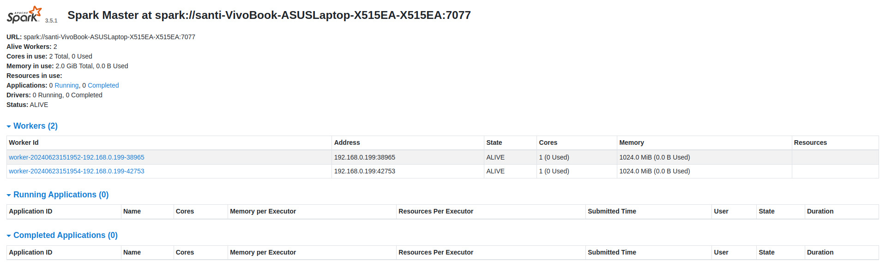
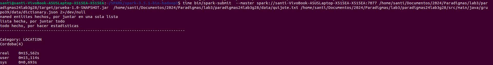
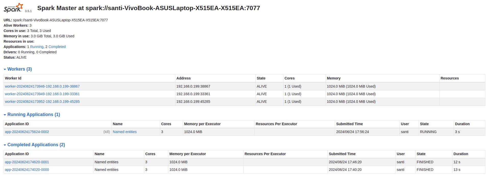

## Indice:

1. [Inicialización](#inicialización)

    - [Spark](#spark)

    - [.jar](#.jar)

2. [como correr el programa](#programa)

2. [Programa](#programa)

3. [Experiencia](#experiencia)

4. [Conclusión](#conclusión)

5. [Extras](#extras)

# Inicialización

## Spark

Este laboratorio utiliza spark-3.5.1-bin-hadoop3 para ejecutar el proyecto, una vez descargado se debe ingresar a la carpeta `${SPARK_FOLDER}/sbin`  siendo `${SPARK_FOLDER}` el directorio donde se encuentra Apache Spark.

Una vez adentro, se lanza una instancia del master: `./start-master.sh`

Luego se lanza una instancia de worker: `./start-worker.sh spark://localhot:7077`

También se puede configurar las características de los workers en el archivo `${SPARK_FOLDER}/spark-3.5.1-bin-hadoop3/conf/spark-env.sh` si es que lo tiene si no se crea y se le pone las siguientes líneas

    

    | 1. SPARK_WORKER_CORES=1 

    | 2. SPARK_WORKER_INSTANCES=2

    | 3. SPARK_WORKER_MEMORY=1g  

los cuales setean la c/workes, cantidad de memoria por worker, y los cores de c/worker, para este lab lo recomendable es modificar solo SPARK_WORKER_INSTANCES 

una vez todo inicializado, si está todo ok en la url http://localhost:8080 debería aparece algo como esto:

## .jar:

Ahora vamos con la parte de inicializar nuestro archivo .jar para esto nos moveremos a la dirección donde se encuentra descargado nuestro ` $APP_HOME/INFORME.md` siendo ` $APP_HOME` donde se encuentra **INFORME.MD** .

Una vez nos encontremos allí realizaremos el comando `mvn clean install` y con esto tendremos nuestro archivo .jar.

Haciendo `ls target` podremos ver el archivo `prueba-1.0-SNAPSHOT.jar`.

# Como correr el Programa

Para ejecutar el programa se escribe por la terminal, desde `${SPARK_FOLDER}` la siguiente línea

`$ bin/spark-submit  --master local[2] $APP_HOME/target/prueba-1.0-SNAPSHOT.jar  $APP_HOME/data/pf.txt  $APP_HOME/data/dictionary.jso 2/dev/null`

Del cual nos importa los parámetros seguidos de local[2] los cuales son ubicación del archivo .jar, el texto a leer en formato .txt y por último el diccionario a utilizar.

También es importante saber que **local[2]** se puede cambiar al puerto que aparece en la página web para ello debemos poner **spark://mycpu:7077** en lugar de local[2], donde mycpu está indicado en la parte superior de la página web

Esto nos sirve para ver como trabajan los worker a la hora de paralelizar una tarea, dándonos características como el tiempo que tarda en realizar cierta tarea, cantidad de cores destinas, memoria, etc.

Aquí va un ejemplo de como correrlo en la terminal:

y ahora un ejemplo de como se vería en la web

# Experiencia

En este laboratorio tuvimos que desarrollar una nueva App que recolecta las entidades nombradas a partir de un archivo fijo y un diccionario en formato JSON de las entidades que se podrían llegar a encontrar. El desarrollo de la App es crear una configuración de Spark, y luego setear las condiciones para que los workers en ella lean línea a línea nuestro texto.

Cada trabajador implementará la heurística por defecto (en el caso del laboratorio subido al bitbucket será Capitalized Word) para extraer las entidades nombradas de cada línea. Luego, también de forma paralela, cada entidad nombrada será computada con base en el diccionario previamente mencionado. 

Al final el contenido de todos los workers será juntado en una única lista de entidades nombradas, la cual usaremos para obtener las estadísticas y la impresión de las mismas. Esto no se ejecutará de forma paralela, ya que esta función también imprime las estadísticas, y eso queremos que se realice una única vez con el listado total de las entidades nombradas computadas. Una mejora al alcance de concurrencia de nuestro laboratorio, es que lo que originalmente era la función get_and_print_stats la separemos en 2 funciones, una de get y otra de print, de forma que podríamos paralelizar la función get, cuyo objetivo principal seria contar la cantidad de veces que aparece cada entidad nombrada y clasificarla en un tópico o categoría. (En el archivo del bitbucket está seleccionado por default el modo categoría)

El manejo de datos fue a través de tipos JavaRDD implementando maps a esas estructuras para poder obtener los nuevos datos que queríamos tras aplicarle una función. Por ejemplo una vez que tenemos el JavaRDD  String  con las líneas, le aplicamos la función map con DoHeuristic, para obtener un nuevo tipo JavaRDD. Esto le asigna a cada línea en el primer JavaRDD una lista de Strings correspondiente a la lista de candidatos obtenida al aplicarle la heurística a esa línea. 

# Conclusión

Logramos una implementación concurrente de la extracción y cómputo de entidades, lo cual permite mejorar la eficiencia de la extracción y paralelizar el trabajo.

Sin embargo podemos notar que la heurística "two times" que era la mejor a la hora de evitar falsos positivos pierde mucho valor, pues esta se aprovecha de obtener información del resto del texto (a ver si esa palabra luego aparece sin mayúscula, y en su defecto descartarla como name entity), pues cada heurística se corre en una sola línea, en vez de en el texto completo.

# Extras

Este laboratorio fue principalmente de investigación acerca de spark, y de lidiar con los diferentes errores que iban surgiendo en el proceso de querer paralelizar la cosas, un detalle importante está en la implementación de la clase Heuristics que originalmente era todo (o casi todo) static, y ahora no, lo cual tiene sentido, ya que cada trabajador instancia un objeto de la clase Heuristics y obteniendo sus propios candidatos, estaría mal que todos obtengan los mismos candidatos.

Probamos este laboratorio también con el texto igual a todos los feeds de noticias, que esta como pf.txt, la obtención de este texto es igual a como está implementado en el lab2 la obtención del pf sin aclarar el feed, esto también podría ser paralelizado para que diferentes workers parseen diferentes xml y luego junten todo en este archivo que sería el correspondiente. Luego podríamos juntar todo el texto obtenido de cada parseo de xml y utilizar la misma app que tenemos ahora.